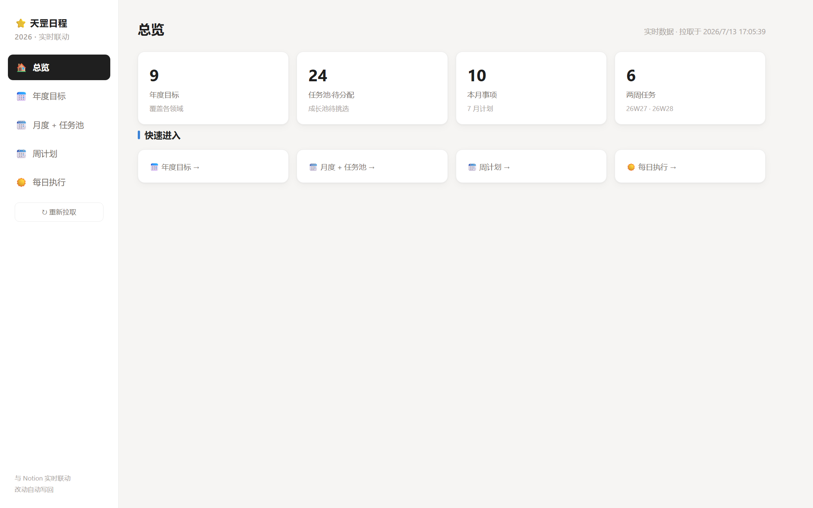
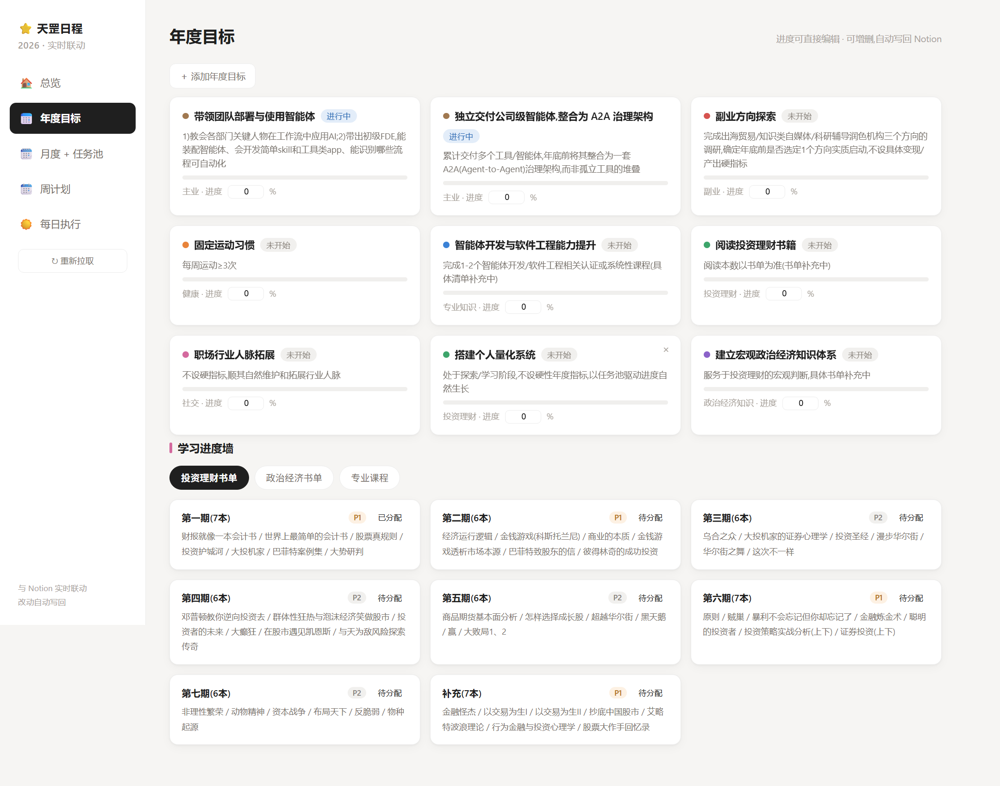
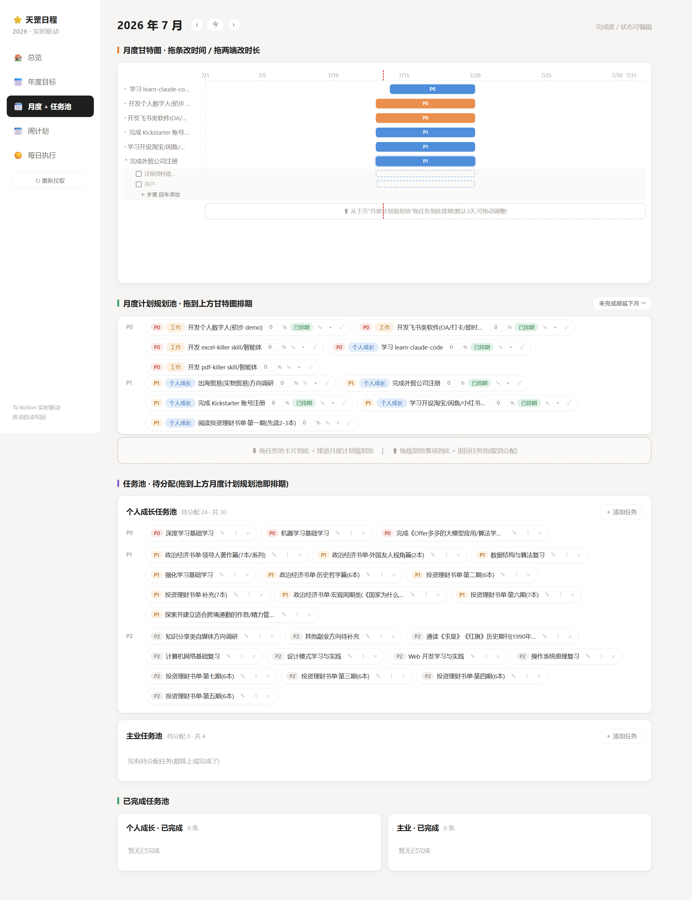
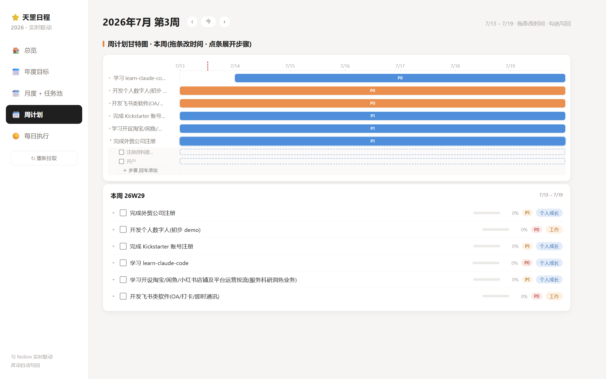
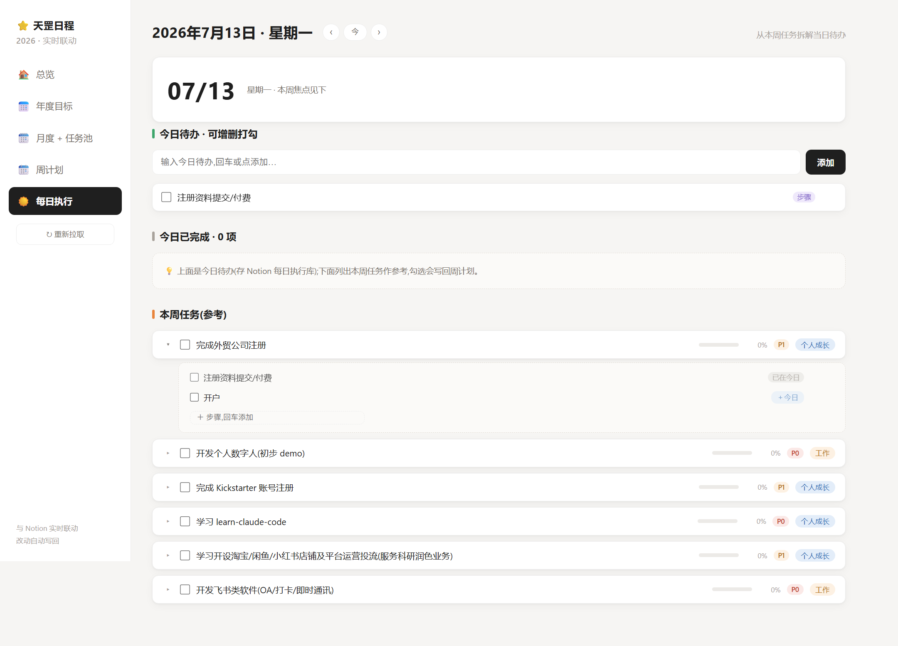

# ⭐ 天罡日程管理系统 (notion-life-dashboard)

自托管的 **Notion 双向实时同步** 目标管理仪表盘：把 Notion 里的 **年度目标 → 任务池 → 月度计划 → 周排期 → 每日待办** 串成一条完整的执行闭环，用一张好看的网页大屏来规划和推进。

- **一个后端文件 + 一个前端文件**（`server.js` + `public/index.html`），无构建、无数据库
- **无状态设计**：服务器不存任何数据，每次读取都现拉 Notion，页面上的每个改动实时写回 Notion —— Notion 是唯一数据源，手机上打开 Notion 就是天然移动端
- 为不稳定网络设计的**对账韧性**：写操作响应丢失时自动与 Notion 对账，不产生脏数据

---

## ✨ 这个项目能干什么

| 能力 | 说明 |
|---|---|
| 🎯 年度目标管理 | 按领域分类的目标卡片，进度/状态可直接编辑，增删即时写回 Notion |
| 🗂 双任务池 | 「个人成长 / 主业」两个待分配任务池，按优先级分层横排；灵感随时入池 |
| 🗓 月度规划池 | 任务池一键 ↑ 或拖拽进入月度；确认弹框顺手拆步骤；卡片可就地编辑名称/优先级(级联同步所有关联视图) |
| 📊 拖拽甘特图 | 规划池任务拖进甘特图即排期；拖条改时间、拖两端改时长、拖标签上下排序；一个任务只一条排期(细分放步骤) |
| 🪜 步骤子甘特 | 点开任务条展开步骤清单，每个步骤有自己的时间条，**在父任务范围内**拖拽编排；步骤日期以 `📅` 标记存进 Notion 待办文字，手机 Notion 也能看到 |
| ✅ 每日执行闭环 | 从本周任务把步骤点/拖进当日待办；勾掉待办 → Notion 步骤自动打勾 → 任务完成度自动重算 → 甘特/月度全视图联动；反向勾选同样同步 |
| ⏪⏩ 时间导航 | 月/周/日三个页面都有 `‹ 今 ›` 按钮，随意翻看过去与未来的规划(粗→细自动级联锚定) |
| ↷ 一键顺延 | 月底把没做完的任务(含未排期的)一键顺延到下个月，旧排期作废、步骤跟着任务走 |
| 📈 完成度自动化 | 任务有步骤时完成度 = 已勾步骤/总步骤，自动写回 Notion；无步骤时手动填 |
| 🔐 口令门 | 简单口令保护(自定义 header)，适合个人自托管 |

## 📸 页面演示

### 总览



- 年/月/周/日四层进度一屏总览，各卡片可点击跳转到对应子页面
- 数据每次进入页面现拉 Notion，右下角一键重新拉取

### 年度目标



- 按领域(投资理财/专业知识/健康/副业/主业…)着色的目标卡片墙
- 当前进度、状态直接在卡片上编辑，即时写回 Notion；支持增删

### 月度 + 任务池（核心页面）



- **月度甘特图**：拖条改时间、拖两端改时长、拖左侧标签上下排序、标题旁 × 一键退回规划池；点击任务条展开**步骤子甘特**，步骤时间条在父任务范围内自由编排，未排期步骤显示为幽灵条(点击=按整段落定)；面板内可直接增删/改名/勾选步骤
- **月度计划规划池**：按 P0/P1/P2 分层的任务胶囊，显示进度%、已排期徽章；拖进甘特图=排期，拖回下方虚线区=退回任务池；右上角「未完成顺延下月 ↷」
- **任务池**：待分配任务按优先级横排，✎ 编辑、↑ 排进月度(弹框可顺手拆步骤)、× 删除；已完成任务沉淀到独立的已完成池，可 ↩ 恢复
- 页头 `‹ 今 ›` 切换月份，各月的规划互相独立

### 周计划



- 聚焦本周 7 天的甘特图，与月甘特同款交互(排期条/步骤子甘特/排序)
- 跨出本周窗口的任务显示为只读虚线条，防止误拖改写真实日期
- 下方本周卡片：任务勾选完成写回 Notion，可展开同一份步骤清单

### 每日执行



- **当日待办**：增删打勾，存 Notion 每日执行库；带「步骤」徽章的待办勾选时**串行双写**——先写每日完成、再同步 Notion 步骤勾选、任务完成度联动重算，网络失败自动回退不留分叉
- **今日已完成**：勾掉的待办自动挪入下方已完成区，取消勾选挪回
- **本周任务(参考)**：点整行展开步骤面板(进度条实时联动)；步骤点行=就地改名，`＋今日` 按钮/拖拽=加入当日待办；面板内可增删勾选步骤
- 页头 `‹ 今 ›` 逐日翻看，待办清单/任务参考跟随所选日期

## 🏗 架构

```
浏览器(public/index.html 单页) ⇄ Express(server.js, 无状态) ⇄ Notion API
```

| 文件 | 职责 |
|---|---|
| `server.js` | 全部后端：聚合读取 `/api/data`、字段更新 `/api/update`、分配/退回、周排期、步骤 CRUD/排期/改名、月度完成、每日待办联动。所有写操作直达 Notion |
| `public/index.html` | 全部前端：内联 CSS/JS,自建甘特(pointer 拖拽)、HTML5 拖放、乐观更新 + 失败对账 |

步骤(子任务)存储在**月度任务 Notion 页面正文的 to-do 块**里，无需额外数据库；步骤排期以灰色文本标记 ` 📅YYYY-MM-DD→YYYY-MM-DD` 追加在待办文字尾部（改名/勾选都不会破坏标记与 Notion 内格式）。

## 🚀 快速部署（Agent 友好）

> 想让 AI 帮你部署？直接把本节末尾的[「AI Agent 部署提示词」](#-复制给-ai-agent-的部署提示词)整段复制给你的 Agent。

### 0. 前置

- Node.js ≥ 18（内置 fetch）
- 一个 Notion 账号 + [Internal Integration](https://www.notion.so/my-integrations)（拿到 `ntn_` 开头的 token）

### 1. 在 Notion 建 6 个数据库

结构定义在 **[`docs/notion-schema.json`](docs/notion-schema.json)**（机器可读）。要点：

| 数据库 | 关键属性（中文属性名必须逐字一致） |
|---|---|
| 年度目标 | `目标`(title)、`领域`(select: 投资理财/专业知识/政治经济知识/健康/社交/副业/主业)、`成功标准`(rich_text)、`年份`(select)、`当前进度`(number)、`状态`(**status**: 未开始/进行中/完成) |
| 个人成长任务池 | `任务`(title)、`优先级`(select: P0/P1/P2)、`状态`(select: 待分配/已分配/已完成)、`分配月份`(rich_text) |
| 主业任务池 | 同上一行 |
| 月度计划 | `事项`(title)、`月份`(select, 形如 2026-07)、`类型`(select: 工作/个人成长)、`优先级`(select)、`完成度`(number)、`关联任务池`(relation→个人成长任务池)、`关联主业任务池`(relation→主业任务池) |
| 周计划 | `任务`(title)、`完成情况`(checkbox)、`类型`/`优先级`(select)、`开始日期`/`结束日期`(date)、`周次`(rich_text)、`排序`(number)、`关联月度事项`(relation→月度计划) |
| 每日执行 | `待办`(title)、`日期`(date)、`完成`(checkbox)、`关联步骤`(rich_text) |

建完后：**每个数据库都要 `···` → 连接 → 添加你的集成**，否则 API 全部 404。

### 2. 配置与启动

```bash
git clone https://github.com/icarus0926/notion-life-dashboard.git
cd notion-life-dashboard
npm install
cp .env.example .env        # 填 NOTION_TOKEN / DASH_PASSWORD / 6 个数据库 ID
node server.js              # → http://localhost:8787
```

Windows 可直接双击 `start-local.bat`（自动开浏览器）。

数据库 ID 获取：浏览器打开数据库整页，URL 中 `notion.so/` 之后、`?` 之前的 32 位十六进制串。

### 3. 自检

```bash
curl -s -H "x-dash-key: 你的口令" http://localhost:8787/api/data
# 返回 JSON 且含 goals/growthPool/workPool/monthly/weekly/daily 六个数组 = 部署成功
```

### 4.（可选）云服务器常驻

```bash
npm i -g pm2
pm2 start server.js --name life-dashboard && pm2 save && pm2 startup
# 防火墙放行 PORT;公网部署强烈建议设强口令并加 HTTPS 反代
```

### 🤖 复制给 AI Agent 的部署提示词

````text
请帮我部署 notion-life-dashboard（https://github.com/icarus0926/notion-life-dashboard）：
1. clone 仓库并 npm install（需 Node ≥ 18）。
2. 读 docs/notion-schema.json，在我的 Notion 里创建其中定义的 6 个数据库：
   数据库名、属性名(中文)、属性类型、select 选项都必须与 schema 完全一致；
   「年度目标.状态」是 status 类型不是 select；relation 按 schema 的 target 指向对应库。
3. 提醒我创建 Notion internal integration 拿 token，并把 6 个数据库逐个「添加连接」共享给该集成。
4. 复制 .env.example 为 .env：填入 token、一个强口令、6 个数据库的 32 位 ID(从各库页面 URL 提取)。
5. node server.js 启动，然后 curl -H "x-dash-key: <口令>" http://localhost:8787/api/data 自检：
   返回 JSON 含 goals/growthPool/workPool/monthly/weekly/daily 六个数组即成功；
   若 404 说明某个库没共享给集成，逐个检查；若启动即报"缺少环境变量"按提示补齐。
6. 成功后告诉我访问地址和口令输入方式(打开网页输入 DASH_PASSWORD)。
````

## ⚠️ 注意事项

- 界面为**中文**；周起始为周一，时间按运行环境本地时区
- 口令门是轻量防护（明文 HTTP header）。公网部署请设强口令 + HTTPS 反代；更稳妥的方式是只在本机/内网跑
- Notion API 有限速（约 3 req/s），正常个人使用远达不到
- 页面加载速度取决于你到 Notion API 的网络质量（无状态设计，每次都现拉）

## License

[MIT](LICENSE)
